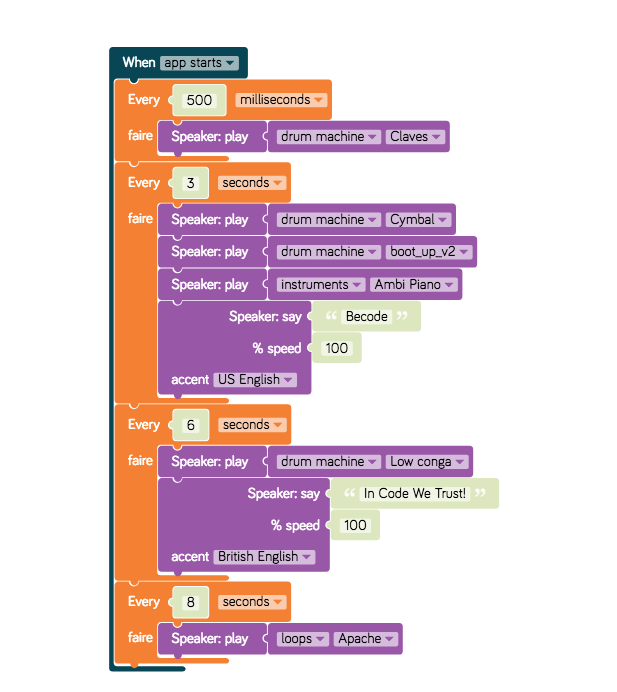

# Exercise your logical mind

You want to program but you don't understand the logic? Kano allows you to program without coding via a drag and drop interface. Doing the first 18 levels of its tutorial will help you to understand the different logic structures in a playful way.

Go to kano.me and do at least the first 18 levels: https://world.kano.me/projects

