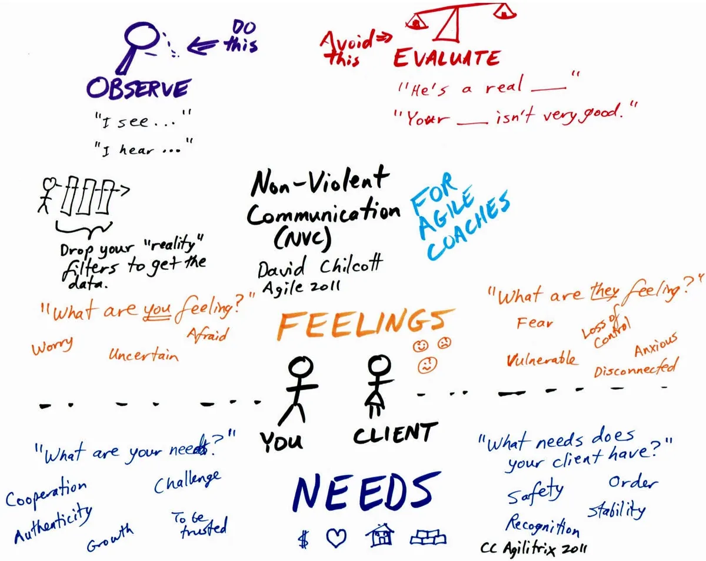
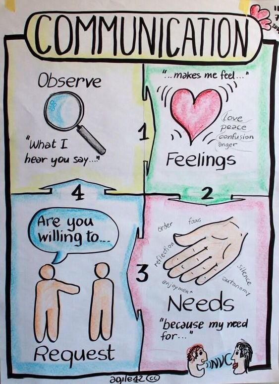

# Practicing Nonviolent Communication

NVC is a way of being in a relationship, which we have spontaneously in many situations, facilitating communication, cooperation and the resolution of differences.

It gives us concrete and profound ways to find this way of being. By helping us to **identify each other's needs**, she encourages us to **use language that fosters the heart's momentum** rather than language that contributes to resentment or diminishes self-esteem.
It begins with the realization that life enrichment is the most rewarding motivation for our actions, rather than fear, guilt, blame or shame. It encourages us to focus on taking responsibility for our choices and improving the quality of our relationships.
It is effective even when the person or group in front of us knows nothing about the process.

Nonviolent Communication makes us understand that :
- All our actions are aimed at fulfilling unmet needs
- It is healthier for everyone to satisfy needs through cooperation than through competition.
- Human beings naturally enjoy contributing to the well-being of others when they can do so with this momentum.

Through Nonviolent Communication, we can:
- Create more rewarding human relationships.
- Find ways to meet our needs that honour and respect our values and those of others.
- Heal from past painful or unhappy experiences and relationships.

The practice of Nonviolent Communication helps us to:
- Dispel feelings of guilt, shame, fear, and depression.
- Transform anger or frustration into a momentum that will lead to coalition and cooperation.
- Find solutions based on safety, mutual respect and consensus.
- Meet the basic needs of the individual, family, school, community and society in ways that enrich life.

## In one image

## In a book
Amazon: [amazon](https://www.amazon.com/Being-Genuine-Stop-Nice-Start/dp/1892005212)
