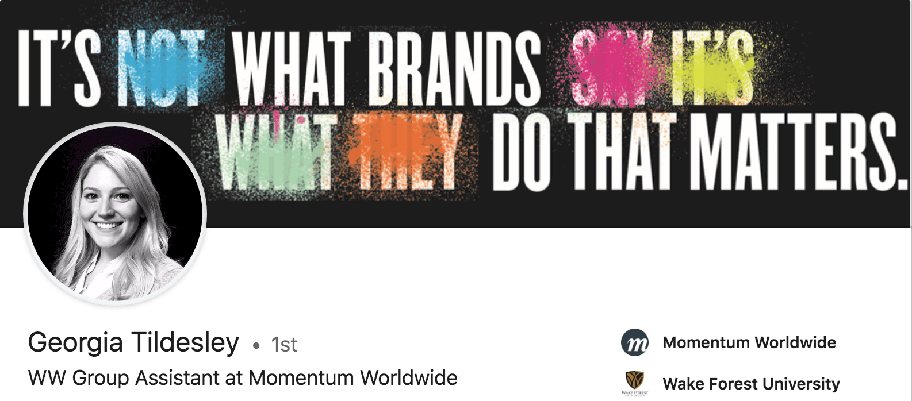
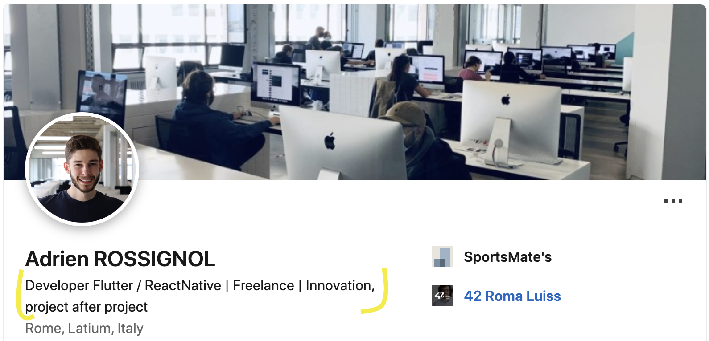
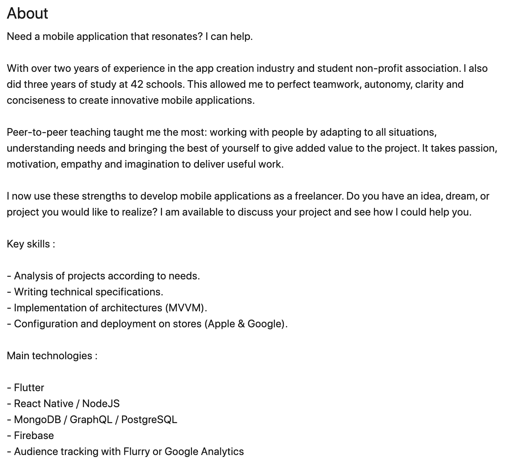

> What recruiter these days doesn't take a look at the LinkedIn profile of the candidates they are considering hiring?

Everyone is on social media, gleaning additional information about their recruitment targets... The same goes for your potential clients; when selecting their supplier, they don't hesitate to search and scrutinize LinkedIn for competent individuals who could help them.

And your presence on LinkedIn is crucial: do the exercise, type your name in Google. Chances are, your LinkedIn social media profile will come up in the top results of the search engine.

>  How to work on your profile, and thus stand out on the first professional network?

### Follow this guide and those 18 LinkedIn good practices

# 1/ Claime your personalized profile URL

One of the simplest actions, but one that matters. Make sure you personalize your public profile URL.

It is also important to have a profile URL that is easily remembered by your visitors. An "optimized" profile URL can also serve your organic SEO, on Google and on LinkedIn.

To implement this first recommendation, it will take you no more than 2 minutes:

    1. Click on the "You" icon at the top of your LinkedIn homepage.
    2. Click on "View Profile".
    3. Click on "Edit Public Profile and URL" in the right hand module.
    4. Under Edit Your Custom URL in the right hand module, click on the pencil icon next to your public profile URL.
    5. This is an address that will look like www.linkedin.com/in/votrenom.
    6. Type the last part of your new custom URL in the text box.
    7. Click Save.

> For exemple, my LinkedIn profil integrates my full name « adrien-rossignol », taken up everywhere on the web : https://linkedin.com/in/adrien-rossignol

# Image of the param

## 2/ Your LinkedIn profile picture: put a professional picture

> Professionals interact with other "live" professionals.

Your photo is one of the keys to "humanizing" your presence on LinkedIn. You need to show your face if you want to be credible.

The rules are the same as for a resume: a photo of yourself smiling, in professional attire and with a neutral background. You don't necessarily have to wear a suit and tie, with your phone on your ear... That said, stay professional. Avoid "informal" photos, sometimes taken in places that have nothing to do with the business world.

To reinforce your personal branding, use the same photo as your other social networks. This way, users who come across you in different places on the web will recognize you at a glance.

Finally, you should know that there is a free tool, [Snappr](https://www.snappr.com/photo-analyzer/), that allows you to automatically evaluate the quality of your Linkedin profile photo. The tool also gives you a series of recommendations to improve it.

# Image of snapp

## 3/ Add a banner to your Linkedin profile

The banner or cover photo dresses up the header of your profile. It is advisable not to leave the one proposed by default by LinkedIn, at the risk of appearing a "fake profile" or giving a sloppy image to your visitors.

It is therefore preferable to have a more personal LinkedIn banner, to make a good impression and inspire confidence. It will better reflect a part of your career, your personality characteristics, your professional goals...

The recommended size for this image is 1584 x 396 px. The image must be in JPEG, PNG or GIF format, and its size must be less than 4MB. Leave some space at the bottom of the image, as the top of your profile tends to "cut off" the banner.

## 4/ Optimised your profile title like if it was an article title

LinkedIn provides you with a 120 character "title" field to indicate your professional identity. This title is displayed under your first and last name. Do not be "mysterious". On the contrary, this LinkedIn presentation in the title should be explicit about your skills and what you can bring to a company.

> Your professional title is your headline, which should perfectly represent your value proposition.

You can simply indicate your current position or the title of the position you are targeting if you are actively looking. It may also be a good idea to specify a sector of activity if it is relevant to you.

You can also be more creative with your profile title, to make it more catchy, and really make people want to read the rest of your profile. The key is to stay precise, punchy and relevant.

On the other hand, banish from your title the words "available", "looking for a job" or "listening to the market"... It is a field that is made to arouse curiosity, to highlight your key competence, to communicate your aspirations... not to stick a label on your forehead.

Finally, think about the SEO of your LinkedIn profile; make sure to include in your profile title some keywords that are likely to be searched by your target audience. This will eventually allow you to be more easily found by recruiters or your ideal clients.

## 5/ Indicate the city in which you want to work

If you want to work in a city other than the one you are currently in, update the city in your profile.

For example, if you live in Grenoble but want to work in Paris, put "Paris" as your city on your profile.

This may not seem like a big deal, but where you say you are completely changes the nature of the people who contact you.
This is also a good way for LinkedIn to automatically recommend jobs in the city you are interested in.

## PHOTO

## 6/ Take care of the 2000 characters in the "info" section of your LinkedIn profile

Your summary ("info" section) is the poor relation of many profiles and deserves your full attention. It is the ideal place to tell "your story" in 2000 characters maximum.

To write the right summary, you need to keep in mind who you want to convince. Even for your LinkedIn profile, working on a persona is not a luxury.

What message do you want to convey to them?
What action do you want them to take?
Write in the first person singular and work on the first 3 lines of your summary, which are the only ones visible at first glance: with a sentence of accorche, make the reader want to click on "see more" to read the rest and mention the most important points from the start.

You can also capitalize certain words to create sections in your summary. However, keep the paragraphs short (no more than 3 lines) and keep using relevant keywords.

Also remember to conclude your LinkedIn summary with a call to action, encouraging them to interact with you :

On LinkedIn of course,
or on a landing page you've created especially,
but you can also communicate your email,
or your business phone number to let people choose the mode of communication that suits them best.

## 7/ In your LinkedIn profile summary, talk about these five things