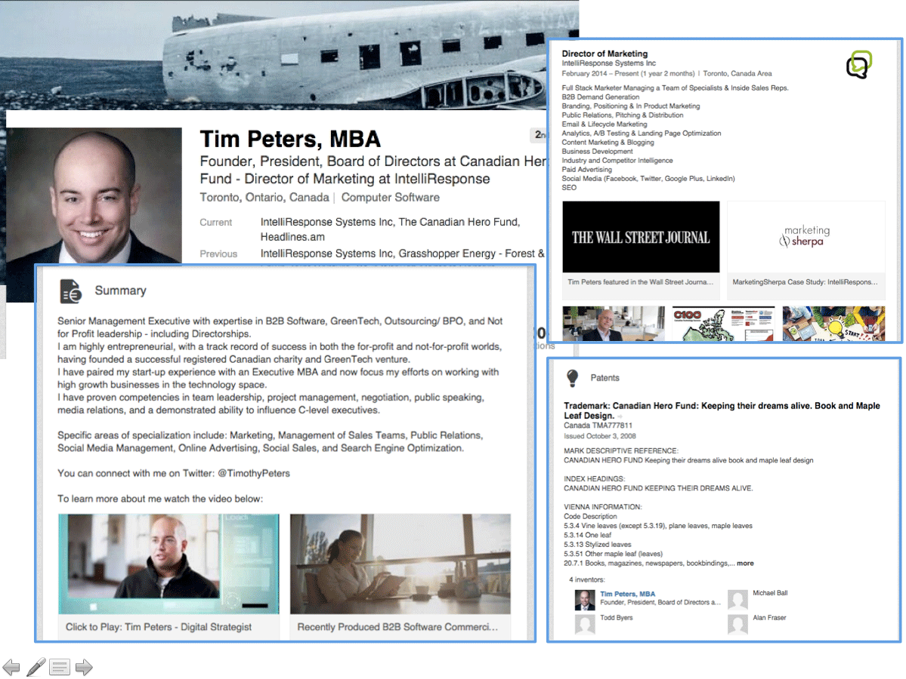

> What recruiter these days doesn't take a look at the LinkedIn profile of the candidates they are considering hiring?

Everyone is on social media, gleaning additional information about their recruitment targets... The same goes for your potential clients; when selecting their supplier, they don't hesitate to search and scrutinize LinkedIn for competent individuals who could help them.

And your presence on LinkedIn is crucial: do the exercise, type your name in Google. Chances are, your LinkedIn social media profile will come up in the top results of the search engine.

>  How to work on your profile, and thus stand out on the first professional network?

### Follow this guide and those 18 LinkedIn good practices

# 1 - Claime your personalized profile URL

One of the simplest actions, but one that matters. Make sure you personalize your public profile URL.

It is also important to have a profile URL that is easily remembered by your visitors. An "optimized" profile URL can also serve your organic SEO, on Google and on LinkedIn.

To implement this first recommendation, it will take you no more than 2 minutes:

    1. Click on the "You" icon at the top of your LinkedIn homepage.
    2. Click on "View Profile".
    3. Click on "Edit Public Profile and URL" in the right hand module.
    4. Under Edit Your Custom URL in the right hand module, click on the pencil icon next to your public profile URL.
    5. This is an address that will look like www.linkedin.com/in/votrenom.
    6. Type the last part of your new custom URL in the text box.
    7. Click Save.

> For exemple, my LinkedIn profil integrates my full name « adrien-rossignol », taken up everywhere on the web : https://linkedin.com/in/adrien-rossignol

# Image of the param

## 2 - Your LinkedIn profile picture: put a professional picture

> Professionals interact with other "live" professionals.

Your photo is one of the keys to "humanizing" your presence on LinkedIn. You need to show your face if you want to be credible.

The rules are the same as for a resume: a photo of yourself smiling, in professional attire and with a neutral background. You don't necessarily have to wear a suit and tie, with your phone on your ear... That said, stay professional. Avoid "informal" photos, sometimes taken in places that have nothing to do with the business world.

To reinforce your personal branding, use the same photo as your other social networks. This way, users who come across you in different places on the web will recognize you at a glance.

Finally, you should know that there is a free tool, [Snappr](https://www.snappr.com/photo-analyzer/), that allows you to automatically evaluate the quality of your Linkedin profile photo. The tool also gives you a series of recommendations to improve it.

# Image of snapp

## 3 - Add a banner to your Linkedin profile

The banner or cover photo dresses up the header of your profile. It is advisable not to leave the one proposed by default by LinkedIn, at the risk of appearing a "fake profile" or giving a sloppy image to your visitors.

It is therefore preferable to have a more personal LinkedIn banner, to make a good impression and inspire confidence. It will better reflect a part of your career, your personality characteristics, your professional goals...

The recommended size for this image is 1584 x 396 px. The image must be in JPEG, PNG or GIF format, and its size must be less than 4MB. Leave some space at the bottom of the image, as the top of your profile tends to "cut off" the banner.

## 4 - Optimised your profile title like if it was an article title

LinkedIn provides you with a 120 character "title" field to indicate your professional identity. This title is displayed under your first and last name. Do not be "mysterious". On the contrary, this LinkedIn presentation in the title should be explicit about your skills and what you can bring to a company.

> Your professional title is your headline, which should perfectly represent your value proposition.

You can simply indicate your current position or the title of the position you are targeting if you are actively looking. It may also be a good idea to specify a sector of activity if it is relevant to you.

You can also be more creative with your profile title, to make it more catchy, and really make people want to read the rest of your profile. The key is to stay precise, punchy and relevant.

On the other hand, banish from your title the words "available", "looking for a job" or "listening to the market"... It is a field that is made to arouse curiosity, to highlight your key competence, to communicate your aspirations... not to stick a label on your forehead.

Finally, think about the SEO of your LinkedIn profile; make sure to include in your profile title some keywords that are likely to be searched by your target audience. This will eventually allow you to be more easily found by recruiters or your ideal clients.

## 5 - Indicate the city in which you want to work

If you want to work in a city other than the one you are currently in, update the city in your profile.

For example, if you live in Grenoble but want to work in Paris, put "Paris" as your city on your profile.

This may not seem like a big deal, but where you say you are completely changes the nature of the people who contact you.
This is also a good way for LinkedIn to automatically recommend jobs in the city you are interested in.

## PHOTO

## 6 - Take care of the 2000 characters in the "info" section of your LinkedIn profile

Your summary ("info" section) is the poor relation of many profiles and deserves your full attention. It is the ideal place to tell "your story" in 2000 characters maximum.

To write the right summary, you need to keep in mind who you want to convince. Even for your LinkedIn profile, working on a persona is not a luxury.

What message do you want to convey to them?
What action do you want them to take?
Write in the first person singular and work on the first 3 lines of your summary, which are the only ones visible at first glance: with a sentence of accorche, make the reader want to click on "see more" to read the rest and mention the most important points from the start.

You can also capitalize certain words to create sections in your summary. However, keep the paragraphs short (no more than 3 lines) and keep using relevant keywords.

Also remember to conclude your LinkedIn summary with a call to action, encouraging them to interact with you :

On LinkedIn of course,
or on a landing page you've created especially,
but you can also communicate your email,
or your business phone number to let people choose the mode of communication that suits them best.

## 7 - In your LinkedIn profile summary, talk about these five things

In the previous paragraph we discussed the importance of your LinkedIn profile summary, and distilled some generic advice.

To help structure the rest of your writing, make sure you address 5 broad categories in your profile summary:

- Your "wins": what have you accomplished that is great in your career? Be specific and concrete. Use numbers whenever you can.

- Your "values": what differentiates two professionals with the same skills are their values, their passions, their deepest beliefs... Share in your summary what inspires you and what guides your professional actions in your daily life.

- Your "differences": explain what makes you different from other people in your profession. Mention your areas of expertise, where you are undoubtedly "stronger than the average"; this can be a technical skill, as well as an attitude, a way of being.

- Your "key figures": what if you only had to describe yourself with numbers? Quantifying your profile and career is important to convince any potential recruiter/partner. Numbers also contribute to your credibility, as they are factual elements that really "measure" your value.

- Your "references": you only exist through the eyes of others... Mention what others think of you, why they recognise and consider you. Use verbatims, testimonials, recommendations on your talents.

Once you have finished your essay, test it with other people.

- Does your summary represent you well? Is there anything missing?
- Does it highlight your "value proposition" as a professional?
- If your respondents were to make one change to improve your summary, what would it be?

## Maybe picture ???

## 8 - Work on describing your work experience as if it were a separate story in your career

Your experiences should be described by telling your story, and by explaining what you have achieved in the tasks you have been given.

It is of course advisable to also record all your experiences as a volunteer and member of an association, as well as your other projects. These can tell a lot about your personality, general skills and interests.

If you have a lot of experience, focus on the most recent positions.

The point is not to have long descriptions of experience; no one has time to dwell on what you have done in great detail. Focus on impact.

Refine the description of your experience over and over again, cutting out any unnecessary words,
or those that don't add much to your message.
Ideally, descriptions of your experiences should not exceed 5 lines.

They should indicate what you have achieved in each position, not just a description of your tasks. Be specific and use figures where possible. And always include information about the companies you have worked for (even for an internship), as recruiters may search on this criterion.

##PHOTO

> This diagram summarises all aspects of work experience, and the different elements that make up the 'job story'. Use it as a guide for writing job descriptions that are not 'just' descriptive.

## 9 - Work on your LinkedIn referencing, analyse the profiles of other users

> LinkedIn is not just a social network. It is also a search engine.

I myself, when I am looking for a supplier or a person with specific skills, I type my query... on LinkedIn!

So you need a well thought out 5 step approach to improve your position in LinkedIn search results.

1. To "break down the clutter", make a list of keywords that you would like your profile to rank for.

2. Study their search volumes via Keyword planner; this will tell you which phrases are most used (e.g. marketing director or marketing manager?).

3. Type in the keywords on LinkedIn. Make a note in a spreadsheet of the position you appear in.

4. Study the profiles of the people in the top positions: what do they do differently? Where do they place the key phrase in question?

5. Replicate the practice on your own profile and see if it improves the ranking of your profile over time.

To learn more about SEO and how to track your LinkedIn SEO performance, find the right keywords and what to optimize, I invite you to watch this 5 min video on this topic:

[Video](https://www.youtube.com/watch?v=5JvU9M3bXfI)

## 10 - List your "trainings" on LinkedIn, it's an excellent networking tool

The 'Education' section is not to be overlooked. This is where you indicate the schools/universities from which you graduated, the dates and the grades you obtained in your "student" life.

This section dedicated to your training courses has several advantages:

- It defines your educational background for recruiters/partners.

- And it allows former alumni to find you, or even to be spotted by former classmates who can further your career.

## PHOTO

> Schools remain an available search criterion in LinkedIn: some contacts/recruiters use this criterion in their talent searches

## 11 - Fill in the skills that make you stand out and for which you can be recommended

LinkedIn gives you the opportunity to select skills. You can select these by using the keyword search bar provided by LinkedIn.

Be smart about the skills you list on your profile. You can enter up to 50 skills. But the aim is not to have as many as possible (between 3 and 5 skills is enough), but above all that they are recognised by other people.

- Indeed, the more your skills are "recognised" by other LinkedIn users.

- The more likely you are to appear on LinkedIn search results when this skill is searched for.

## PHOTO

> People in your network can recommend your skills

This is why it is preferable to **only indicate the skills that you have a real mastery of**, that are **important** for your readers, **that make you stand out** and for which you can easily be recommended.

Furthermore, **only the first three skills you enter are visible directly on your profile**(without having to click on "See more"). You will therefore have to prioritise them...

## 12 - Add media elements to your LinkedIn profile

LinkedIn lets you add images, videos, Slideshare presentations, etc. in the "Info" or "Experiences" sections. Take advantage of this to **enhance the credibility** of your profile and **differentiate** yourself.

> If you are looking for a job for example, a short video of 30 seconds to 1 minute will humanise your profile and 'sell' you much better.

In all circumstances, take the opportunity to add **documents that illustrate your work**.

This can be a scan of your **certifications** or a presentation of your **portfolio**... If you have a **blog**, it can be a good idea to add an image on your profile that redirects the user to your site. This is a way to **strengthen your credibility** and provide **proof of your skills**.

> The multimedia elements you can add to your profile reinforce your credibility and make your achievements tangible

## 13 - Ask for recommendations that will enhance your LinkedIn profile

> "Let others talk about you"... This is a very powerful personal branding strategy!

To appear competent in the eyes of your visitors, recommendations are decisive. They show that many outsiders recognise your skills. They are **excellent social proof** for your personal branding.

It is also reasonable to assume that **profiles that contain recommendations from third parties rank much higher in search results**, which ultimately contributes to your visibility.

Ideally, **you should have at least one from each of your professional experiences**. There is no need to aggregate light recommendations either; one strong, sincere and well-written recommendation will be worth more than 5 recommendations of 3 words each.

You can ask for recommendations from **people you work with** on a daily basis or your **former colleagues**. You can also dare to ask your **clients, partners, suppliers** or even your **teachers** if you are a student. In all cases, you keep control and moderate the recommendations that will be displayed on your profile.

When asking for a recommendation, remember to **personalize the request**. Don't send the "automatic" LinkedIn message, and write on your message:

- The context in which you worked with this person.

- The skills for which you would like to be recommended.

- An invitation to talk about it directly if the person wishes.

To go further on this topic of LinkedIn recommendations, to know what is the ideal number and who you should ask, watch this video which answers these questions in less than 3 minutes.

[Video](https://www.youtube.com/watch?v=_xVZ9WGAqXI)

## 14 - Join groups relevant to your profile and interests

You can join **up to 50 groups** on LinkedIn. The platform explicitly displays on your profile the ones you belong to. This gives visitors to your profile additional information about you, your areas of expertise and your interests.

> Groups to which you are subscribed appear directly on your LinkedIn profile

But this is not just a façade, **in these groups, real experts are motivated to exchange** with other professionals on the subjects that interest them.

> This is why you also need to be 'active' in the groups you join if you want to get the most out of them.

**Ask questions** of the community, **help** those who are looking for expert advice... Helping others is always a great way to get noticed. **Stay humble**, and in a continuous learning posture. You will be surprised at the results!

## 15 - Connect regularly with other professionals on LinkedIn

Of course, the purpose of LinkedIn indirectly is to connect with as many people as possible. After all, LinkedIn is a social network like any other, isn't it?

- As well as putting your LinkedIn profile address everywhere - business card, email signature, website...

- Add people you meet in real life, at conferences...

If possible, **keep the conversation going** with your recent connections. For example, send a thank you email, and if you are using LinkedIn to find new clients, plan to send a follow-up message or two. In your communication, **make sure you provide something of added value**:

- An article found on the web that will interest your contact.

- A white paper related to their industry.

- The name of someone in your network with whom they could do business...

The following video gives you 5 types of messages to send on LinkedIn when you want to connect with someone.

[Video](https://www.youtube.com/watch?v=lHQlcsuAl_c&feature=emb_title)

The more you expand your network, the more you gain access to a wider and wider "2nd and 3rd degree" network, opening up even more possibilities...

Many LinkedIn experts agree that the more connections you have, the higher your profile will appear in LinkedIn search results.

## 16 - Follow the leading companies in your sector on LinkedIn

As on Facebook, LinkedIn now offers the possibility to follow company pages, to "Liker" them.

The companies you follow are also **a good way to show on your LinkedIn profile who you are.** Make sure you follow your company page, but also those of leading companies in your industry. Remember, there is such a thing as "LinkedIn social selling"!

You will also be kept informed of their new publications, but also of their job offers if you are actively searching.

## PHOTO

*By going to the LinkedIn page of the company you are looking for, you will be able to follow its publications and job offers with one click.*

## 17 - Share value-added news regularly on your LinkedIn profile

> Sharing information is a great way to engage with your LinkedIn network.

If you also have a blog/site, be sure to share your own content. If you also identify an interesting piece of information or quote that might interest your network, share it without hesitation.

## PHOTO

*Your activity and the news you share appear directly on your LinkedIn profile*

Beyond your network, this will allow you to **build " communities "** willing to engage with you. It is also a great way to ensure a **constant presence in the minds of your network**, and to interact with them.

This is why you will not fail **on your side to interact with the news that other people in your network publish** by liking and/or commenting on them... They will return the favour when you publish content yourself.

If you find this a daunting task, a free tool such as Hootsuite or Buffer allows you to easily schedule your posts in advance, across multiple platforms including LinkedIn.

## 18 - Publish blog posts directly on LinkedIn

For some time now, LinkedIn has been offering users from all over the world to blog directly on the platform. This is a good practice because:

- **Your entire network is notified** of your new publication.

- And these articles are **highly ranked** on LinkedIn and Google.

For "new" bloggers, starting on LinkedIn is a great idea. It allows you to **benefit from an audience** naturally, and to the merit of focusing your writing **on a professional platform**, consulted every day by millions of professionals.

For more tips on the right way to blog on LinkedIn, I leave you with this latest video that delivers some very actionable advice.

[Video](https://www.youtube.com/watch?v=9zj757wz_Tg)

